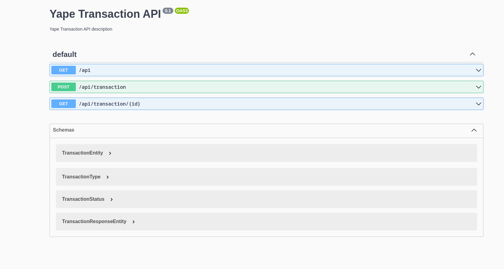

# Documentation

## Definition

It's required to create a microservices application that validates the transaction amount. A transaction is valid if the amount is less than or equal to 1000. A greater amount invalidates the transaction.
The status of each transaction can be PENDING, APPROVED and REJECTED.
Due to the nature of the business, the response time to a query about the status of a transaction is required to be as short as possible.

## Diagrams C4 Model

### Context

### Containers

### Containers: Transaction Microservice

### Components: Transaction Microservice

### Containers: Anti-fraud Microservice

## Sequence diagram

## Pre-requisites

- NodeJS (version 18)
- Docker Desktop (version 4.23)
- Any terminal

## Install dependencies

- Execute "npm install" from the directory "anti-fraud"
- Execute "npm install" from the directory "transaction"

## Containers Docker

- There are 11 services to create and run containers included in compose.yaml. Some of them have depends on others services.
- Almost all containers have implemented healthchecks.
- I removed limits in usage resources (cpu and ram).
- List of containers:
  - zookeeper
  - kafka
  - kafka_ui
  - mysql-server
  - mysql-client
  - mongo-server
  - mongo-client
  - jaeger
  - transaction
  - anti-fraud
  - sonarqube

## Run containers

- Execute "docker compose up -d mysql-server mysql-client mongo-server mongo-client kafka kafka_ui jaeger" from the directory root

## Execute microservices (local)

- Rename file ".env-sample" to ".env" in the directories "anti-fraud" and "transaction"
- Execute "npm run start:dev" from the directory called "transaction"
- Execute "npm run start:dev" from the directory called "anti-fraud"

## Endpoints (local)

- You can find a postman's collection in the directory called "postman". In that collection, you're going to find a directory named "local" to execute a request to create a transaction and also to execute a request to get status's transaction.

## Execute microservice (containers)

- Rename file ".env-sample" to ".env" in the directories "anti-fraud" and "transaction"
- Execute "docker compose up -d mysql-server mysql-client mongo-server mongo-client kafka kafka_ui jaeger transaction anti-fraud" from the directory root

## Endpoints (container)

- You can find a postman's collection in the directory called "postman". In that collection, you're going to find a directory named "container" to execute a request to create a transaction and also to execute a request to get status's transaction.

## Swagger

- http://localhost:3000/api
  

## Playground GraphQL

- http://localhost:3000/graphql
  

## Dashboards

- Kafka UI: http://localhost:8080
  
- MySQL Client: http://localhost:8082
  
- MongoDB Client: http://localhost:8081
  
  _\* You can find the credentials in file "compose.yaml"_

## Monitoring apps

- Both microservices have implemented OpenTelemetry and the data is send to Jaeger.
- Watch the reports in the url "http://localhost:16686"
  

## Testing

- Execute "npm test" in the directories "anti-fraud" and "transaction"
- Check the results in the directory "reports". There you can find the files "test.v1.html" and "test.v2.html".
  
  
- Check the coverage in the directory "coverage". There you can find the file "index.html"
  
- The % coverages are greater than 64% but they can be improved.

## Quality Code

- Stop "docker compose" and execute "docker compose up -d sonarqube"
- Open the url "http://localhost:9000" in a browser
  
- Create a project and get the security token.
- Update the file "sonar-project.js" located in the directories "anti-fraud" and "transaction". Update the fields: sonar.projectKey, sonar.projectName and sonar.token
- Execute "npm run sonar" in the directories "anti-fraud" and "transaction"

## Notes

- Both projects have implemented clean architect (onion architect + hexagonal architect) and Domain Design Driven (DDD)
- Both projects use clean code
- Both projects have implemented their Dockerfile optimized
- Both projects have implemented ESLint
- I've implemented two databases:
  - The first one is MySQL to save all transactions (writes)
  - The second one is MongoDB. It's optimized to requests about status of any transaction (reads)
- The project "transaction" implements API Rest (writes) and API GraphQL (reads)

## Future improvements

- "Infrastructure as code" can improve the deployment times towards the clouds. I recommend to evaluate "Pulumi".
- Implements Kubernetes' manifests:
  - Pods, Services, Secrets, ConfigMaps, Deployments: Transaction, Anti-Fraud, Database clients, Kafka UI and Sonarqube.
  - Namespaces, Probes.
  - Statefulset: Kafka, MongoDB, MySQL
- Implements Husky and Commitlint in the repository of git
- Implements scripts to deploy (jenkinsfile, buildspec.yaml and so)
- Create libraries and publish them in a private repository to speed the development.
