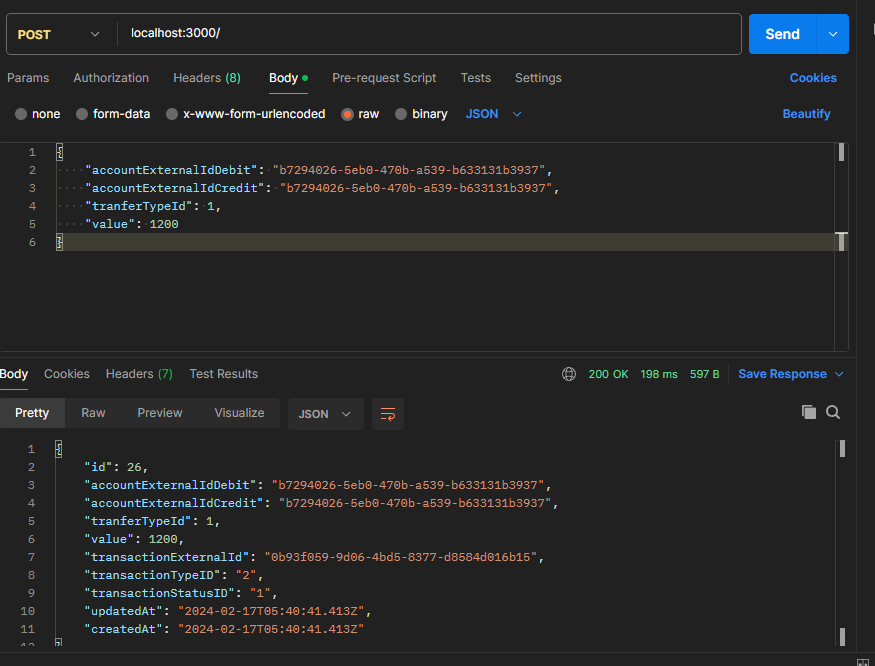

# Yape challenge
Resolución de reto, tecnologias usadas:
* express
* sequelize
* postrgre - kafka 

## Pruebas

En las imagenes hay ejemplo de dos tipos de transacción, con valor rechazado y aprobado
{width='100px'}
{width='100px'}
{width='100px'}
