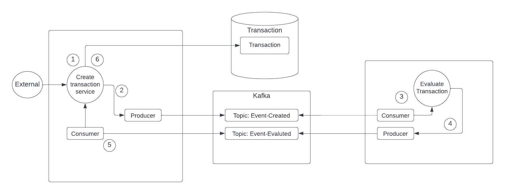

# Solution

## Steps to run

###

1. Copy the local @my-org/common-tools package to the root of each service by running the following script command:

```
cd ./packages/@my-org/common-tools
npm run pack
```

2. Returns to the project's root and run all the solution by executing the following command:

```
cd ../../..
docker-compose up -d
```

3. Seed the relation tables by going to this endpoint: [http://localhost:3000/transactions/seed](http://localhost:3000/transactions/seed)

4. Go to GraphQL explorer ([http://localhost:3000/graphql](http://localhost:3000/graphql)).

- To create a transaction:

```
mutation{
  createTransaction(createTransactionInput: {
    accountExternalIdDebit: "Guid1",
    accountExternalIdCredit: "Guid2",
    transactionTypeId: 1,
    value: 120
  }) {
    transactionExternalId
  }
}
```

- To list all transactions:

```
query {
  transactions {
    transactionExternalId
    transactionStatus {
      name
    }
    value
    createdAt
  }
}
```

## Workflow Explanation



1. An external service calls the Transaction service to generate a record on Transaction table from Transactions database.
2. A producer from Transaction service sends a transaction-created event with Pending status to Kafka event-created topic.
3. A consumer from Anti-fraud service consumes the transaction-created events from Kafka event-created topic.
4. The Anti-fraud service evaluates the consumed event by setting the corresponding status. Then a producer from Anti-fraud service sends the evaluated event to Kafka event-evaluated topic.
5. A consumer from Transaction service consumes the events from event-evaluated topic.
6. The Transaction service updates the transaction table depending on transaction event status.
