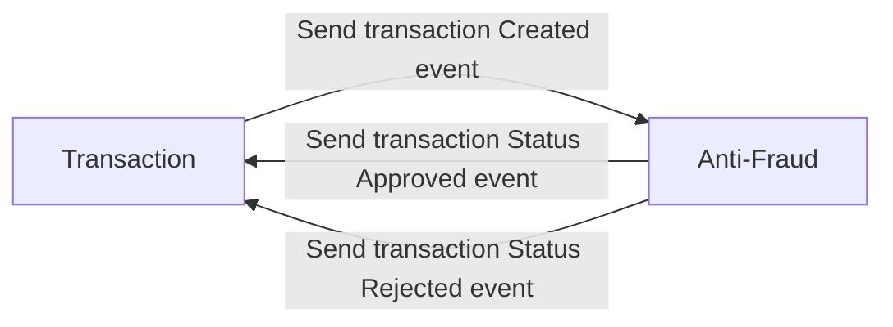

# Anti-Fraud Microservice

## Description
This microservice is responsible for validating whether a transaction is fraudulent or not. To achieve this, it subscribes to transaction creation events in the `transactions` topic and, based on certain business rules, decides whether the transaction is approved or rejected. Once it determines the transaction's status, it publishes an event with the transaction's state in the `anti-fraud` topic.

### Business Rules
- If the transaction amount is greater than 1000, the transaction is rejected.

## Flow Diagram


## Execution
### Requirements
To run the microservice, you must have installed:
- Node.js
- npm
- a Kafka service running on port 9092

### Environment Variables
- `SERVICE_NAME`: name of the service, defaults to `anti-fraud`

- `BROKER_CLIENT_ID`: client id for the Kafka consumer, defaults to `anti-fraud`
- `BROKER_GROUP_ID`: group id for the Kafka consumer, defaults to `anti-fraud`
- `BROKER_INITIAL_RETRY_TIME`: initial time to wait before retrying to connect to Kafka, defaults to `10000`
- `BROKER_TOPIC_TRANSACTIONS`: topic to subscribe to for transaction creation events, defaults to `transactions`
- `BROKER_TOPIC_ANTI_FRAUD`: topic to publish transaction status events, defaults to `anti-fraud`
- `BROKERS`: Kafka brokers to connect to, should be separated by `,`, defaults to `localhost:9092`

### Installation
```
npm install
```

### Execution
```bash
npm run start
```

## Testing
### Execution
```
npm run test
```

### Test Description
#### Unit-Tests - Anti-Fraud - IsFraudulentTransaction
- Transaction with a value less than one thousand is not fraudulent
- Transaction with a value greater than one thousand is fraudulent
- Transaction with a value equal to one thousand is not fraudulent

#### Integration-Tests - Anti-Fraud
- Create a transaction and receive a message
- Create a non-fraudulent transaction
- Create a fraudulent transaction
- Create a transaction with a value equal to one thousand, which is not fraudulent
- Ignore a transaction with invalid data
