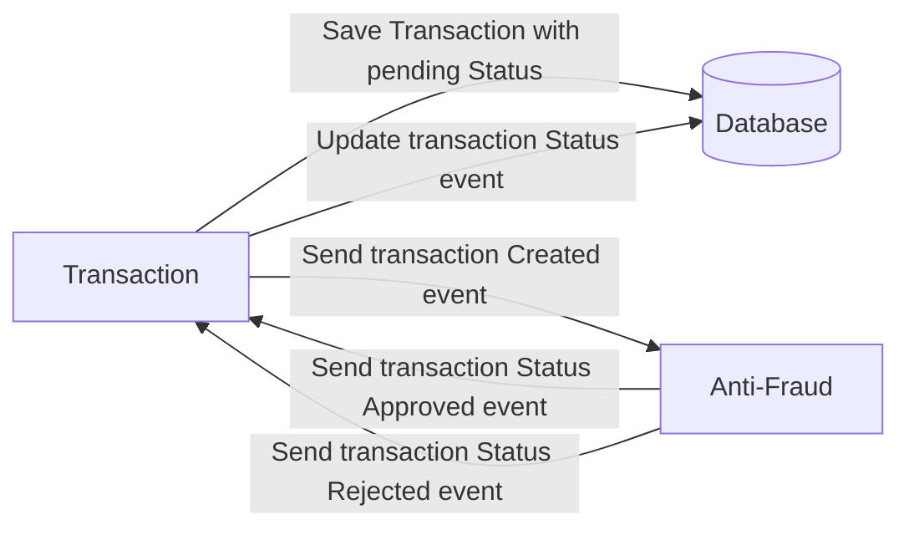

# anti-fraud-ms

Kafka based microservice that verifies a transaction’s value and returns response message on whether it is rejected or approved. Purely event-based.



## Tech Stack
- Node
- Kafka

## Getting started

Execute the following commands in the order they are presented in:

```
$ docker-compose up --build
```
```
$ npm i
```
```
$ export $(cat .env.local | grep -v ^# | xargs)
```
```
$ npm run start
```

The docker-compose command will build and run the required services for the project to run appropriately.

## Consumer

The consumer in this MS will receive messages with the following structure:

```json
{
  "id": "ac8a1cd2-8faf-4386-ab6a-efbab1712c07",
  "value": "1000",
}
```

Depending on whether or not the value exceeds 1000, the transaction will be rejected or approved.

## Producer

The producer in this MS will send messages with the following structure:

```json
{
  "id": "ac8a1cd2-8faf-4386-ab6a-efbab1712c07",
  "status": "APPROVED",
}
```

This is the message that will be consumed by the transaction-api MS to update the DB with the corresponding transaction status.


By: <sergiopietri@gmail.com>
