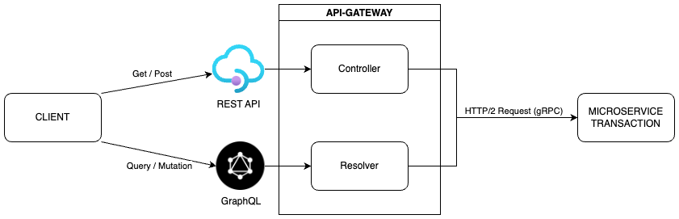
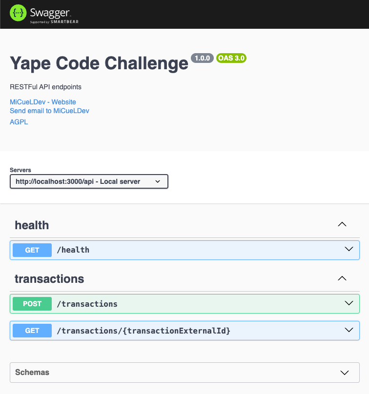
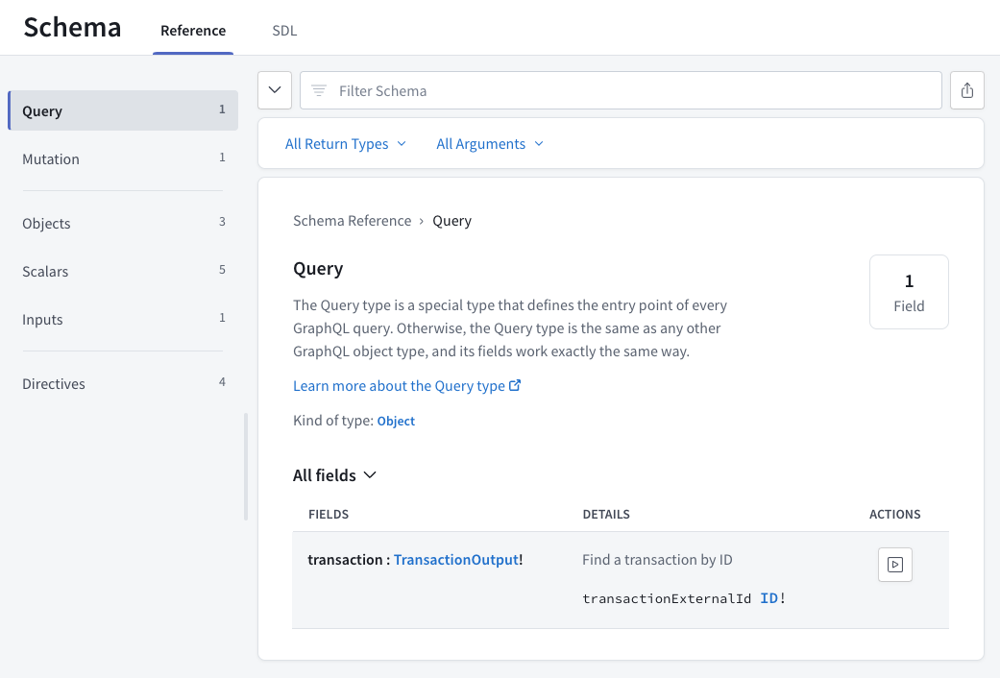
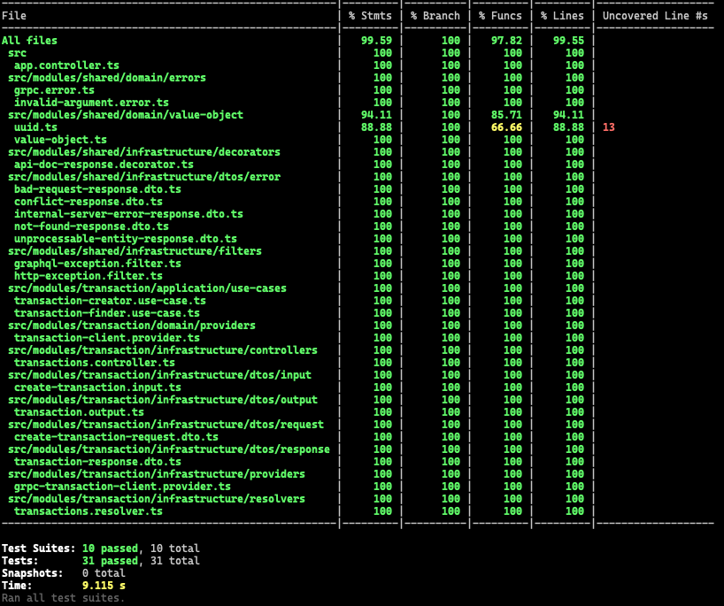

# API Gateway
<p align="center">
  <a href="http://nestjs.com/" target="blank"></a>
</p>

<p align="center">
  <a href="#" target="_blank"></a>
  <a href="#" target="_blank"></a>
  <a href="#" target="_blank"></a>
</p>

## Description
<p>
  Hexagonal API Gateway developed with Nest
</p>

## Diagram
<ul>
  <li>Exposed on RESTful API and GraphQL</li>
  <li>Call to Transaction microservice using gRPC</li>
</ul>



## RESTful endpoints
  Endpoints documented using OpenAPI, show in ```http://{aplication_url}/docs``` for example ```http://localhost:3000/docs```



## GraphQL types
  Types documented using Apollo Plugin, show in ```http://{aplication_url}/graphql``` for example ```http://localhost:3000/graphql```



## Running the app
1. Clone the project
2. Install dependencies
```bash
$ npm install
```
3. Clone the file ```.env.template``` and rename it to ```.env```, edit the new file if necessary
4. Run the app

```bash
# development
$ npm run start

# watch mode
$ npm run start:dev

# production mode
$ npm run start:prod
```

## Tests
<p>
  This microservice has unit tests and functional tests
</p>

```bash
# unit tests
$ npm run test:unit

# functional tests
$ npm run test:functional
```

## Coverage
<p>
  This microservice has a coverage greater than 95%
</p>

```bash
# test coverage
$ npm run test:cov
```


## License
[AGPL licensed](LICENSE).
