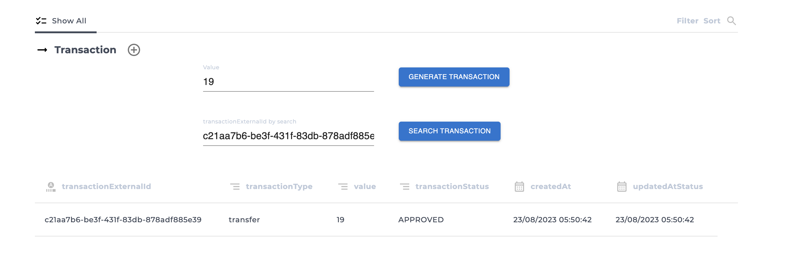

# Card Validation

Prueba tecnica Yapero - Frontend

## Requisitos

- Node.js (versión v18.x.x)
- npm (viene con Node.js)
- Tener libre el puerto 4200

## Tecnologias

- Vite
- React
- MaterialUI
- Jest

## Instalación

1. Instala las dependencias: `npm install` de preferencia la version del node indicado lineas arriba.

## Descripción

Proyecto basico para pruebas de creación de transacciones.

1. Input `value` : Agregar el valor para guardar transacción.
2. Presionar button `Generate Transaction`
3. Input `transactionExternalId by search` se llenara automaticamente cuando se haya generado una transacción.
4. Ahora podemos buscar esta transacción presionando el button `Search transaction`.
5. Una lista se mostrara en base al resultado de busqueda.

## Uso

1. Ejecuta el proyecto : `npm run start` -- anteponer sudo en caso sea necesario.

## Unit Test

1. Para correr las unit test en la consola: `npm run test`
