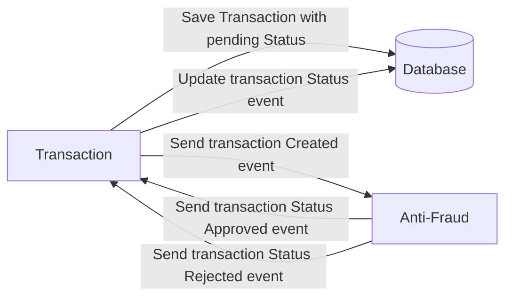

# Yape Code Challenge by Oscar Diaz Iberico

This coding challenge was submitted for the technical assessment of Yape.

## Problem

Every time a financial transaction is created it must be validated by our anti-fraud microservice and then the same service sends a message back to update the transaction status.
For now, we have only three transaction statuses:

<ol>
  <li>pending</li>
  <li>approved</li>
  <li>rejected</li>
</ol>

Every transaction with a value greater than 1000 should be rejected.



## Solution

The solution consists of two microservices:

- `transaction`: exposes a REST API to retrieve / create transactions. When a transaction is created, it is stored in the database and a message is published to a Kafka topic. Once the event is processed, the database record is updated with the result of the message processing.
- `anti-fraud`: it consumes a Kafka topic to verify transactions. Once a transaction is processed, it returns the result to be updated by the transaction service.

## Stack

- Node JS: NestJS, TypeORM, NPM
- Postgres
- Kafka
- Docker

## Try it yourself

Use docker compose to test both services:

```zsh
docker compose up --build
```

Once all the stack is setup, you can go to http://localhost:3000/docs (Swagger docs) to test the `transaction` service API and trigger the process.

## Highlights

- The development environment setup is automated using [Visual Studio Code DevContainers](https://code.visualstudio.com/docs/devcontainers/containers).
  - It packs all the dependencies required to run the project via docker compose (Postgres, Kafka).
  - The installation includes useful extensions to inspect Git, Postgres database, Kafka topics and HTTP requests.
- The project automatically runs checks to enforce commons practices and styling in the code. There are multiple checks configured in this project and they are all executed before code is committed to the repository using `husky` and `lint-staged`.
- The repository implements a monorepo strategy keeping microservices boundaries.
- It implements a CI pipeline using Github actions, which builds the projects and executes the unit tests.
- Both application make use of environment variables for easy deployment across different environments (development, staging, production).
- Database migrations are managed by TypeORM.
- API documentation for transaction service is available under [/docs](http://localhost:3000/docs) path.

## Next steps

- Implement monitoring and alerting (Prometheus / Grafana)
- Implement a security layer.
- Use structured logging.
