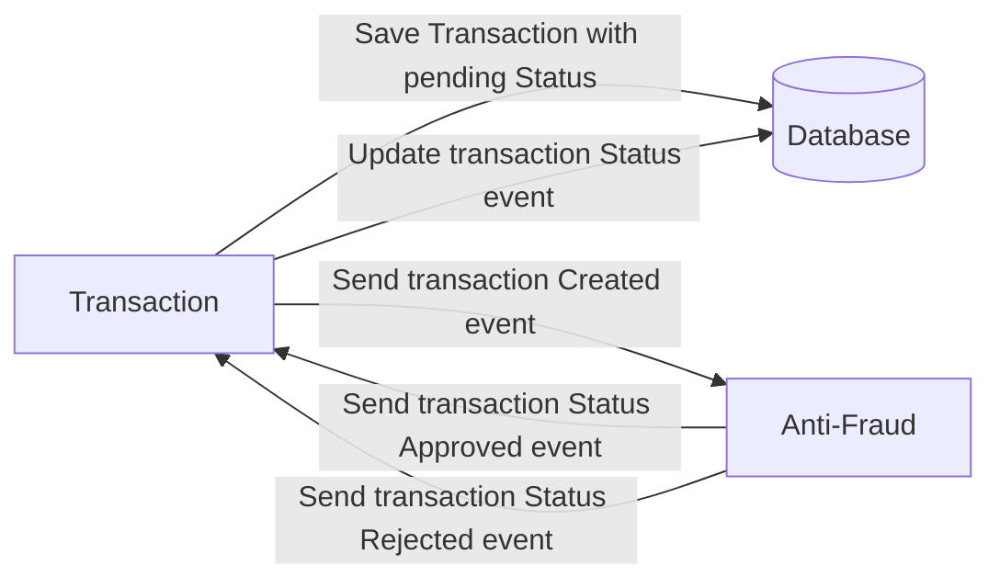

# transaction-api
REST based API microservice for handling the creation and consultation of transactions. It has a dedicated Postgres DB that contains a transfer-type table and a transaction table. Sends events to antifraud asynchronously so execution continues while transactions are validated and the response of that validation is saved.



## Tech Stack
- Node
- Express
- Postgres
- Kafka

## Getting started

Execute the following commands in the order they are presented in:

```
$ docker-compose up --build
```
```
$ npm i
```
```
$ export $(cat .env.local | grep -v ^# | xargs)
```
```
$ ./scripts/runMigration.sh && ./scripts/createTransferTypes.sh

```
```
$ npm run start
```

The docker-compose command will build and run the required services for the project to run appropriately.

## Resources

####  POST `/api/transaction/`:

Once this EP is executed a Kafka event is sent for Anti-Fraud to check the transaction.

```
curl --location 'http://localhost:3000/api/transaction/' \
--header 'Content-Type: application/json' \
--data '{
    "value": 10000,
    "accountExternalIdDebit": "6340a438-eb34-4a87-b45f-cb52190d8c07",
    "accountExternalIdCredit": "6340a438-eb34-4a87-b45f-cb52190d8c07",
    "transferTypeId": 1
}'
```
#### Response:
Returns the values from the saved transaction:
```json
{
  "createdAt": "2023-08-27T18:34:58.899Z",
  "updatedAt": "2023-08-27T18:34:58.899Z",
  "id": "ac8a1cd2-8faf-4386-ab6a-efbab1712c07",
  "status": "PENDING",
  "value": "10000",
  "accountExternalIdDebit": "6340a438-eb34-4a87-b45f-cb52190d8c07",
  "accountExternalIdCredit": "6340a438-eb34-4a87-b45f-cb52190d8c07",
  "transferTypeId": "1"
}
```

####  GET `/api/transaction/:transactionId`:
Retreive details from a specific transaction by passing the id from it.
```
curl --location 'http://localhost:3000/api/transaction/ac8a1cd2-8faf-4386-ab6a-efbab1712c07'
```
#### Response:
Returns specific values from a transaction including the status and the transactionType by name (whose values are saved in the transfer_type table):
```json
{
  "transactionExternalId": "ac8a1cd2-8faf-4386-ab6a-efbab1712c07",
  "transactionType": {
    "name": "wire_transfer"
  },
  "transactionStatus": {
    "name": "REJECTED"
  },
  "value": "10000",
  "createdAt": "2023-08-27T18:34:58.899Z"
}
```

By: <sergiopietri@gmail.com>
