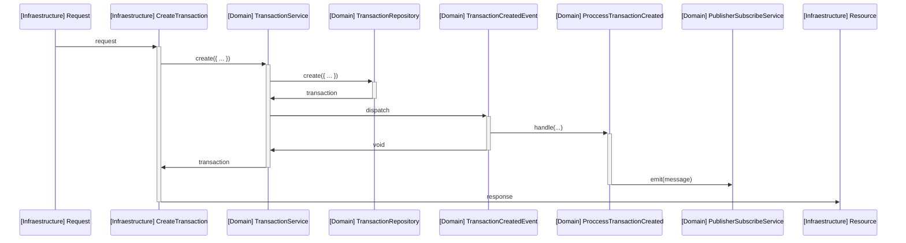
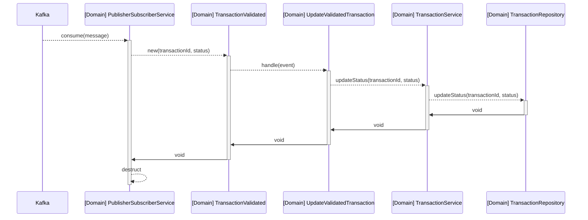
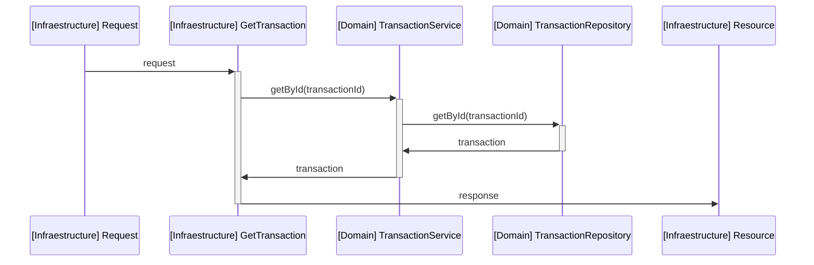

# Transaction Service

1. Clone the `.env.example` file and rename to `.env`. Then change the variable values if neccessary.
2. Start a new query console with postgres. Run the _sql scripts_ in `migrations` folder.
3. Exec `npm run install` for install dependencies.
4. Exec `npm run dev` for development.
5. Exec `npm run build` and then `npm run start` for production.
6. Exec `npm run lint` to apply linter.

## Explaining the solution

I read the problem and I thought about the functional requirements that the transaction service must have to cover the neccesities.

I found the next requirements on the problem statements:

1. The service must have a API to interact with the world (for example, a web service).
2. The service must save the transaction data.
3. The service must be connected with the anti-fraud service to validate transactions.

With these requirements, I think a great solution could be use a simple arquitecture that can scales quickly and can be testable, because the service must be connected to another, probably change dependencies in the future (for example, use a document DB instead of postgres to raise the performance). For that, the arquitecture that I applied was hexagonal arquitecture combined with events and listeners.

I used typescript only for the type help, but I think pure javascript must be a better option if the service does not receive maintain in the future.

I didn't use any ORM or framework keep the project uncomplicated. This is because in the future, I don't know who people want to make changes, and the frameworks and ORMs force to people to learn about them, and probably reduce the project performance, also the project too simple to use any of them.

### The arquitecture

The project is divided into 2 group of layers:

Infrastructure Layer:

Expose an API REST to create or get a transaction.

Domain Layer:

It has the services (business logic), repositories (implements repository pattern to store data), events and listener to propagate some actions in services.

Aso, the domain layer connect with kafka using a service port.

All layers communicate with others using ports previously defined. So all concrete implementations are into bootstrap folder in domain. They can be used via DI.

### Communication with anti-fraud service

When a transaction is created, the transaction service emit a `TransactionCreated` event. A listener called `ProccessCreatedTransaction` handle the event and send a message with kafka with the transaction id and amount.

The anti-fraud service handle the request in kafka (the arquitecture is the same) and when it is proccesed, send a message with the status of the transaction.

The transaction service handle the incoming kafka message and emit a event called `TransactionValidated` that is handled by the listener `UpdateValidatedListener` and updates the transaction status using a service.

## Services

### Create transaction

### Handle transaction validated from anti-fraud service

### Retrieve transaction

