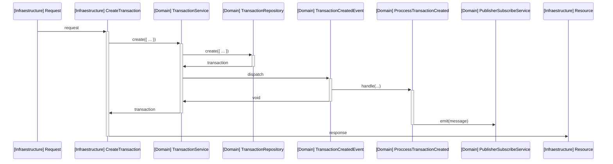
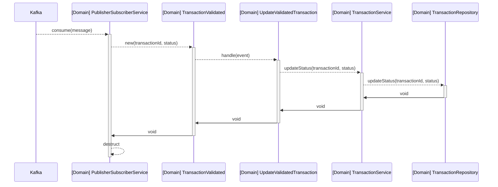
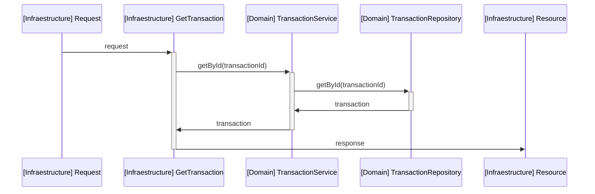

# Transaction Service

1. Clone the `.env.example` file and rename to `.env`. Then change the variable values if neccessary.
2. Start a new query console with postgres. Run the _sql scripts_ in `migrations` folder.
3. Exec `npm run install` for install dependencies.
4. Exec `npm run dev` for development.
5. Exec `npm run build` and then `npm run start` for production.
6. Exec `npm run lint` to apply linter.

## Services

### Create transaction

### Handle transaction validated from anti-fraud service

### Retrieve transaction

