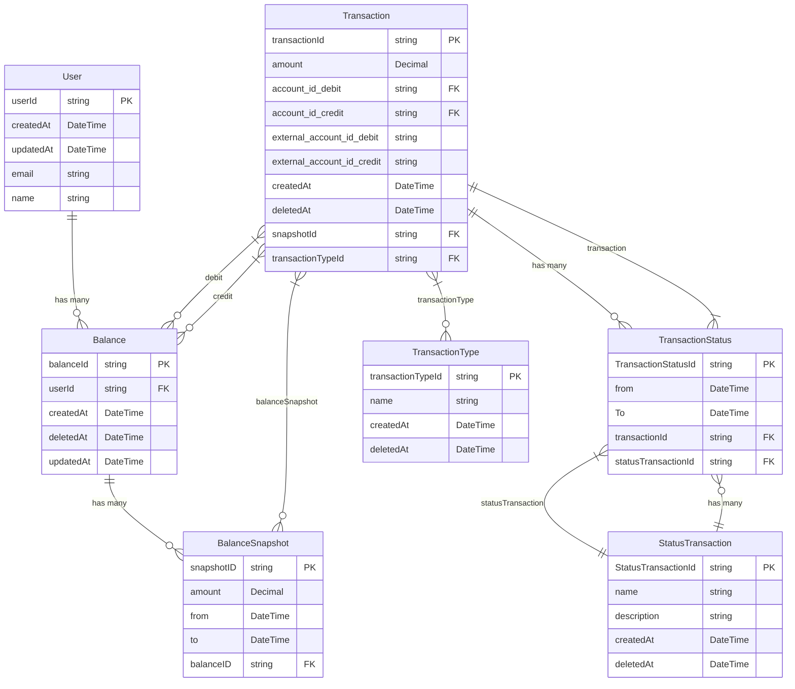

# transactions microservice
This is the transactions microservice.

The database structure is the following:

```mermaid
erDiagram
    User ||--o{ Balance : "has many"
    User {
        userId string PK
        createdAt DateTime
        updatedAt DateTime
        email string 
        name string
    }

    Balance ||--o{ BalanceSnapshot : "has many"
    Balance {
        balanceId string PK
        userId string FK
        createdAt DateTime
        deletedAt DateTime
        updatedAt DateTime
    }

    BalanceSnapshot {
        snapshotID string PK
        amount Decimal
        from DateTime
        to DateTime
        balanceID string FK
    }

    Transaction ||--o{ TransactionStatus : "has many"
    Transaction }|--o{ Balance : "debit"
    Transaction }|--o{ Balance : "credit"
    Transaction }|--o{ BalanceSnapshot : "balanceSnapshot"
    Transaction }|--o{ TransactionType : "transactionType"
    Transaction {
        transactionId string PK
        amount Decimal
        account_id_debit string FK
        account_id_credit string FK
        external_account_id_debit string
        external_account_id_credit string
        createdAt DateTime
        deletedAt DateTime
        snapshotId string FK
        transactionTypeId string FK
    }

    TransactionType {
        transactionTypeId string PK
        name string
        createdAt DateTime
        deletedAt DateTime
    }

    TransactionStatus }|--|| Transaction : "transaction"
    TransactionStatus }|--|| StatusTransaction : "statusTransaction"
    TransactionStatus {
        TransactionStatusId string PK
        from DateTime
        To DateTime
        transactionId string FK
        statusTransactionId string FK
    }

    StatusTransaction ||--o{ TransactionStatus : "has many"
    StatusTransaction {
        StatusTransactionId string PK
        name string
        description string
        createdAt DateTime
        deletedAt DateTime
    }

```
